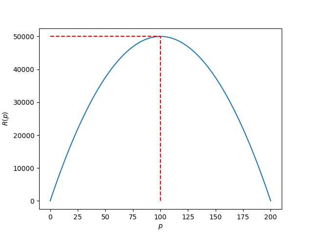
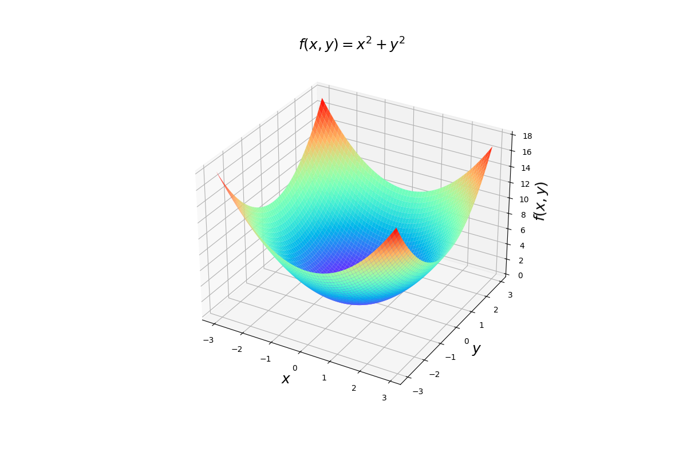
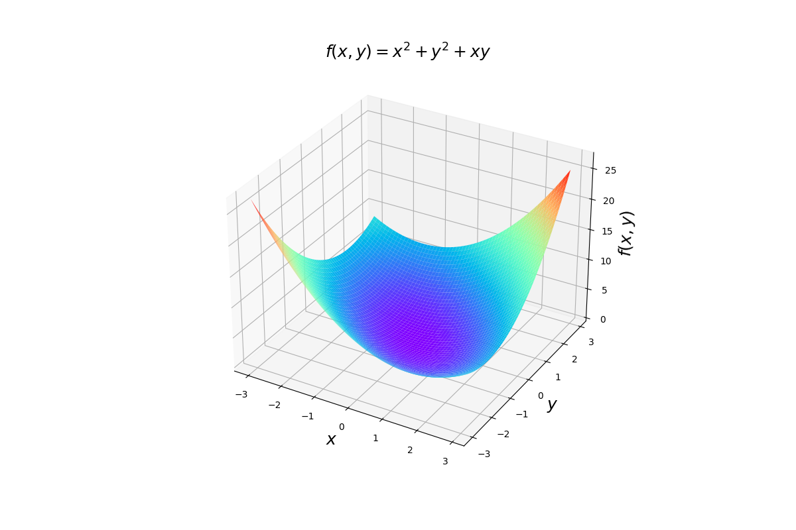
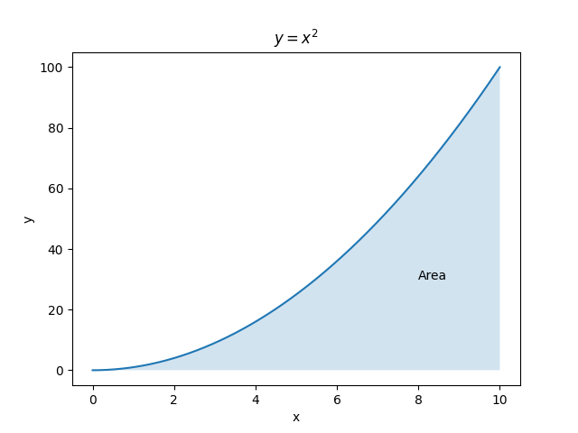

## Optimisation

One application of calculus is to solve optimisation problems. These are problems where we're interested in finding a value of something to maximise or minimise a particular quantity.

Let's look at the following example to introduce optimisation:

**Example:** A car rental company is trying to determine the optimal price to charge per day for renting their cars, in order to maximise their daily revenue. If the price is set too high, the company will have less customers and will make less money. Let $p$ be the price of the car rental and $R(p)$ be the revenue per day. Suppose that $p \in [0,200]$ and that the revenue follows this equation:

$$R(p) = 1000p - 5p^2$$

The function $R(p)$ is plotted on the graph below, with $p$ on the $x$ axis. We can see that there is a particular price $p$ for which the revenue is the maximum. This is the optimal price that the company would want to choose. At the maximum point, the gradient of the function is zero, so we can use calculus to differentiate the function, and then find the value for $p$ for which the derivative is zero.

$$R^\prime(p) = 0 \implies 1000-10p = 0 \implies p=100$$

The maximum point on our graph occurs for $p=100$. Obviously this is quite a simple example, and we could have deduced that from looking at the graph alone, but when our function is more complicated, this technique is very useful. This technique can be used in machine learning to find the minimum point of a loss function when fitting a model, for example.

---

## Multivariable functions

So far we have only considered the situations where we have a function of a single variable, for example $f(x)$ is a function of variable $x$ only. In many real world scenarios, there are multiple variables which determine a particular quantity. For instance, in the car rental example we just covered, if the rental shop is based in an airport, we may have another variable for the number of airport arrivals occurring that day. If there are more passengers arriving, it could mean more potential customers, and hence more revenue.

This introduces the topic of multivariable calculus, where we have multiple inputs for a function. Some examples are shown here, where $f(x,y)$ denotes our function which takes inputs $x$ and $y$.

**Examples:**

* $f(x,y) = x+y$
* $f(x,y) = x^2 + y^2$
* $f(x,y) = xy + \sin(x) - y$

Functions such as these are much trickier to visualise as we have to add another dimension to our plot. The 3D plot here shows the function $f(x,y)=x^2+y^2$. For each point in the $(x,y)$ co-ordinate space at the bottom, there is a corresponding function value which is represented in the surface.

Next we look at how to differentiate such functions.

---

## Partial differentiation

We use partial differentiation, denoted by $\partial$, to find the gradient of multivariable functions. The partial derivative $\frac{\partial z}{\partial x}$ is the derivative of $z=f(x,y)$ with respect to $x$, with the other variable $y$ held constant.

For example, we plot the graph of $f(x, y) = x^2 + y^2 + xy$ in the graph below.

The partial derivative of $f(x,y)$ with respect to $x$ tells us how the function changes when we vary $x$ on its own, keeping $y$ constant. In this example the two partial derivatives are, if we treat:

1. $y$ as a **constant**:
$$\frac{\partial z}{\partial x} = 2x + y$$

2. $x$ as a **constant**:
$$\frac{\partial z}{\partial y} = 2y + x$$

---

## Integration

Integration is the opposite of differentiation.

$$\text{Area} = \int^{10}_{0}x^{2}\,dx$$

