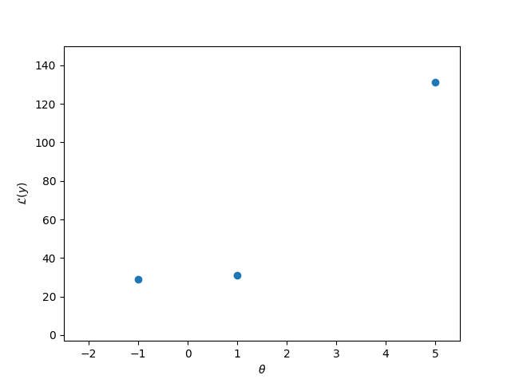
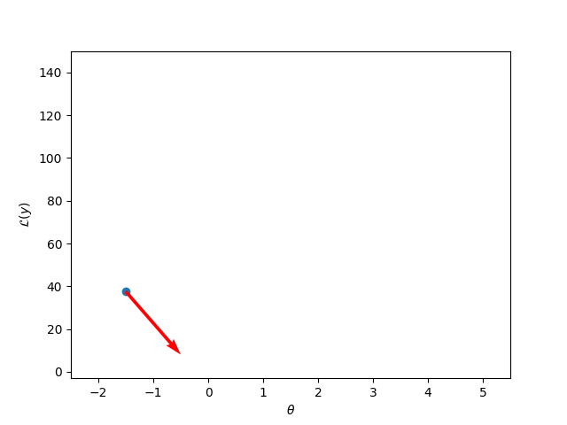
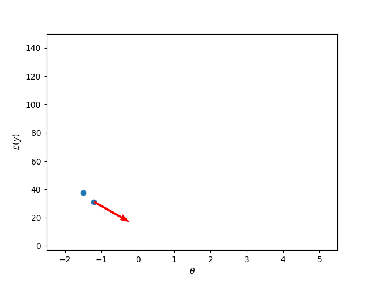
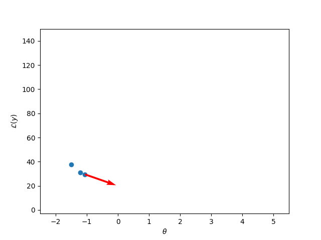
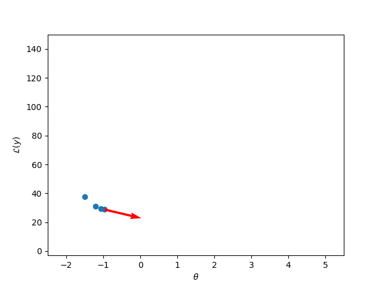
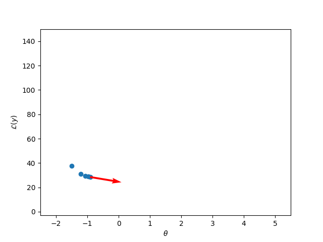
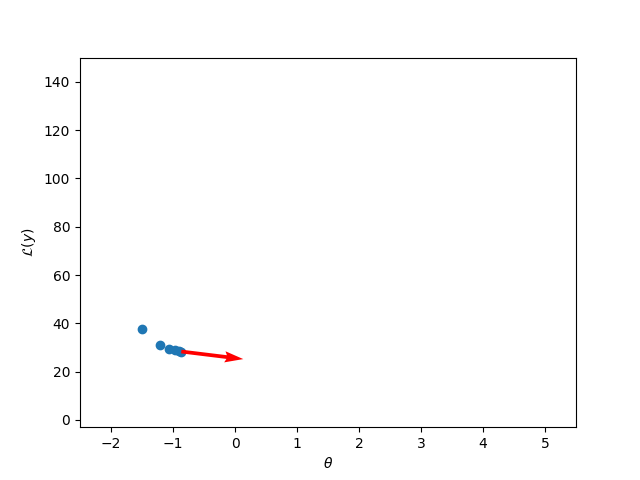

# Introduction to Optimisation

Optimisation is a very large topic, with plenty of research still ongoing. To provide a meaningful introduction, we will be focussing on a single algorithm: gradient descent. This is an algorithm which sees a great deal of use in modern machine learning and data science. We will be focussing on a scenario where the context of the optimisation problem is that we want to train a model. Two sets of training codes will be provided; the first will be to help you become comfortable with the basic algorithm, and the second will involve applying the algorithm to a simple toy machine learning problem.

---

## What is Optimisation?

In the broadest sense, we turn to optimisation when we have some criteria for success (smallest value, largest value) and we have a large space to search to find the object or location that best fits that criteria.

In the context of training a model, we can think of ourselves as trying to find the **best** model from all possible models. Often we constrain ourselves before we do proper optimisation by picking a class of model; a particular neural network architecture, say, or a 200-tree random forest. Once we've done this, however, we still need to find a particular parameter setting or set of trees that gives us the best model. As this is generally a search task a human would take centuries to perform, we turn to optimisation to solve it for us.

*(Note: there might be some confusion about **finding a model** versus **finding the best parameter setting**. Strictly speaking, each parameter setting corresponds to a different model; saying 'my model is a linear model with 20 features' doesn't actually specify a single model. Instead, it specifies a group of models (those linear models with 20 feature parameters and a bias parameter) within which we want to find the best model.)*

---

## Approaches to Optimisation

There are many approaches to optimisation. The choice of the correct approach depends upon several factors:

* Whether you have **access to the function** you're trying to optimise. If so, finding a minimum or a maximum may be much easier.
* Whether you have **access to/can estimate the derivatives** of the function. If so, you may have access to the second derivatives. These are important, as we shall see, because they allow us to be much more intelligent about **where we look** in the space for our solution.
* The **size** of the problem. A space of 100 million parameters is a lot bigger (and as such, slower to search depending on your choice of optimisation algorithm) than a space of 21 parameters. Size also covers various trade-offs between optimisation approaches; some approaches may be guaranteed to converge but take a very long time to run. Some approaches have no guarantee of convergence, but are easy to implement (and thus to debug), and may find a 'good enough' solution quite quickly.
* Are there **pre-existing approaches** out there? Your problem is very unlikely to be fully unique. People will have solved things like it before. Very good libraries exist with implementations of important algorithms. Picking an optimisation approach with multiple examples online is going to be much more successful than trying to do everything yourself.

---

## Optimisation in the Context of Training a Model

We're going to assume that our machine learning approach involves a model with an output $y$ which is fully defined by its parameters $\theta$. We will also assume we have a mathematical function $\mathcal{L}(y)$ that tells us how good our output $y$ is. For example, if we are trying to solve a regression problem (fit a line), then $\mathcal{L}(y)$ might be the squared error (or the mean squared error, over the whole data or a subset of it). Don't worry if this doesn't mean a lot right now; just think of $\mathcal{L}(y)$ as something that **scores** $y$. Generally, it is a convention that smaller scores are better.

If the loss function is **large** when we are doing **poorly**, then we want to find the setting of $\theta$ that **minimises the loss**. This is our optimisation problem. Therefore we can think of the **loss as a function of $\theta$ given $x$**; $\mathcal{L}(f(\theta;x))$.

In this machine learning set-up, there will be a particular loss, $\mathcal{L}(f(\theta;x))$, for each parameter setting. In the case where parameters are real-valued, we can think of all of these loss values as forming a **surface** above the parameter space. For one parameter, this will be a line, for two it will be some sort of plane. It might not be a **smooth** line or plane, but it will cover the whole space of parameters. However, in general, we cannot see this surface; we can only pick a parameter setting and see what loss our model achieves at that setting.

For example, let's suppose that we have a model with a **single parameter** $\theta$ and some data $x$. We choose arbitrarily three values for $\theta$, [-1, 1, 4.5], pass them through the model, and see what loss values we get. We can observe them in the graph below.

As the best value is (just) when $\theta = -1$, we can conclude that we should just choose that parameter value. In fact, it is not that easy. Hopefully, you can see that we can't stop here. In fact, just blindly picking values is probably the worst thing we can do. However, until we know more about what we're dealing with, it's also the **only** thing we can do. How to get more information about what the surface might look like, and hence where it makes more sense to look, is fundamental to any optimisation algorithm. We want to treat our picks for $\theta$ as **probes**; each one should reveal as much to us as possible.

**Idea**: Can we be smarter about which values for $\theta$ we try? For example, for the three points we tried it seems that the further left you go, the smaller the loss. We might **hypothesise**: let's keep going left.

---

## Gradient Descent

Gradient descent **formalises this hypothesis**. Our observation is an estimate of the gradient of the underlying function; how $\mathcal{L}$ changes as $\theta$ changes.

Because we're introducing the easiest form of gradient descent, however, we're going to assume that we have one more thing to help us; every time we try a value for $\theta$, as well as the value of the loss at that point, we also get to know the derivative of the loss with respect to $\theta$, **at that point**. Essentially, when we drop our probe onto the surface, as well as telling us the **height** of the surface, it also tells us the **slope** (both magnitude and direction). This means that gradient descent is a first-order optimisation algorithm.

If our model $y = f(\theta; x)$ is **differentiable** with respect to $\theta$, and our loss $\mathcal{L}(y)$ is **differentiable** with respect to the output of our model $y$, we can **directly compute the gradient of the loss**. For that, we use the chain rule to differentiate back through $y$, as we're treating $y$ as a function of $\theta$:

$$\frac{\partial \mathcal{L}(y)}{\partial \theta} = \frac{\partial \mathcal{L}(y)}{\partial y}\frac{\partial y}{\partial \theta}$$

*(Note: we can absolutely try gradient descent based only on estimated gradients. This is generally slower, as we often need to drop a bunch of probes next to each other to get a feel for the surface.)*

If we can compute the gradient of the loss at a particular parameter setting $\theta$, we can do **gradient descent**. In its simplest form, the **algorithm** looks like this:

1. Initialise $\theta_t$ with some value $\theta_0$.
2. Compute $\mathcal{L}(f(\theta_t;x))$ by passing the data through the model.
3. Compute the gradient of the loss with respect to theta, i.e.
$$\frac{\partial \mathcal{L}(f(\theta_t;x))}{\partial \theta}.$$
4. Set
$$\theta_{t+1} = \theta_t - \lambda \frac{\partial \mathcal{L}(f(\theta_t;x))}{\partial \theta}.$$
5. Repeat from 2.

$\lambda$ is called the **learning rate**. It chooses the size of the step to be taken and is typically a small number. A few notes on the loop:

* **(1)** For a lot of models we generally initialise with quite small values; assuming we've done sensible pre-processing (centered our data, whitened our data etc), we would hope that small parameter initialisation should land the model output in a region of interest at the outset. For some models (most prominently neural networks) there are specific suggestions for initialisation as a function of layer width. The main thing to remember is it is generally advisable to **not** initialise parameters to 0.
* **(4)** This is where we use the information from the gradient to 'step' in a sensible direction. We're assuming that we want to minimise the loss: so we want to step **down** the slope. The $-$ sign comes from the fact that the gradient will point **upwards** towards the direction of the steepest slope (in a multi-parameter setting). We therefore want to head in the opposite direction.

For this to work we are assuming that the loss surface is at least reasonably smooth. 'Smooth' will be relative to things like gradient size and choice of $\lambda$; if we're taking very small 'steps' we may well fall into the cracks we might otherwise leap over. Of course, the bottom of these cracks might contain the very minimum we're searching for.

**Let's see this in action.**

Assume that we've initialised with $\theta = -1.5$, and set $\lambda = 0.01$. We compute the loss for this parameter value, and then we compute the gradient at that point.

Interestingly, the gradient indicates that $\mathcal{L}(y)$ will **increase if we continue leftwards**. The gradient is $-29.5$. You can think of this as showing that **at this point**, the slope is such that an increase in $\theta$ by $1$ means $\mathcal{L}(y)$ will change by $-29.5$.

Following **step 4** of our algorithm, we set $\theta_{t+1} = \theta_{t} - \lambda \frac{\partial \mathcal{L}(y)}{\partial \theta}$. That is, we set $\theta_{t+1} = -1.5 - 0.01 \times (-29.5) = -1.205$. The red arrow **indicates the direction we will move in**; its slope is the magnitude of the gradient.

Visualisation might make this a bit clearer. The most commonly used metaphor is 'hill walking'. Imagine you've been climbing a Munro and a thick fog has rolled in off the sea. You want to get down the mountain, but you can't see more than five feet in front of you. What can you do? Gradient descent provides the answer: you can work out the slope where you are, and head in the steepest downhill direction. The computation in step 4 is simply computing where you will be if you stop after ten steps or so and recheck the slope. This process of walking ten steps, checking the slope, and walking another ten steps is what the gradient descent algorithm is doing on the loss surface.

*(Note: an attentive student might notice that the red arrow shown above points away from the maximum; the gradient itself points upslope, so subtracting it moves us towards the minimum as intended.)*

We then return to **step 2** of the algorithm and continue.

Again, it looks as though we need to keep heading to the right. We'll run the algorithm forward for **5 more steps**.

As we continue, the gradient **tends towards zero** (exactly at a turning point, the gradient would equal zero). This reduces the amount we change $\theta$ by, which slows down the algorithm's progress. Can we assume we've found the minimum? We might think that as we know the value of the loss at $\theta = 1$ is higher than at $\theta = -1$, this must be the location of the minimum. However, we **need to be careful of the assumptions we make about the shape of the loss surface**.

Knowing when we've found a good minimum is a tricky problem. In practical settings, we often use the loss as measured on some held-out subset of our data to see when it reaches a reasonable value, or when it stops decreasing. In complex problems, there are often many minima, and we only need to find one. We will talk about using the data to estimate when we can stop in the second part of this course. For now, we'll move to a practical, to explore basic gradient descent in more detail.