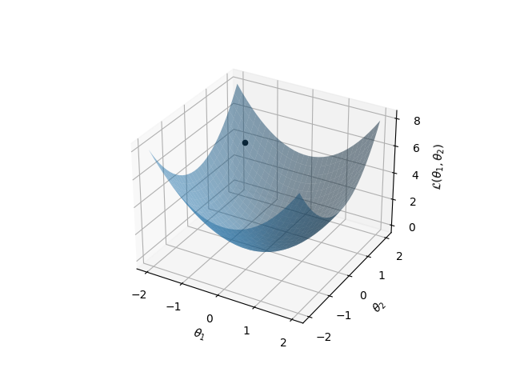
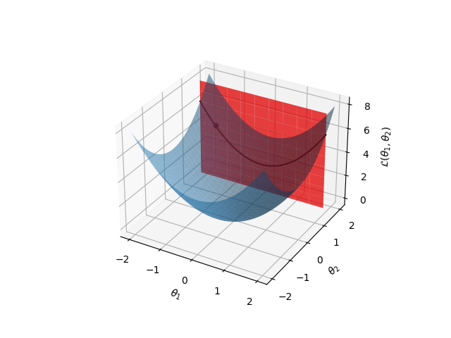
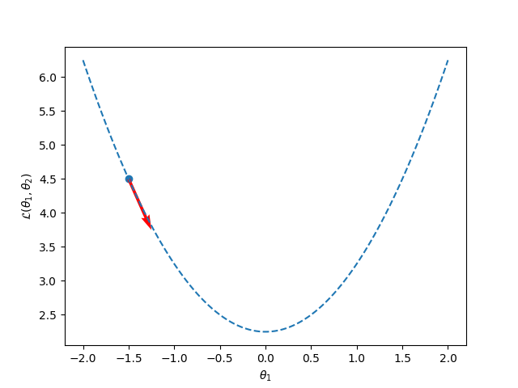
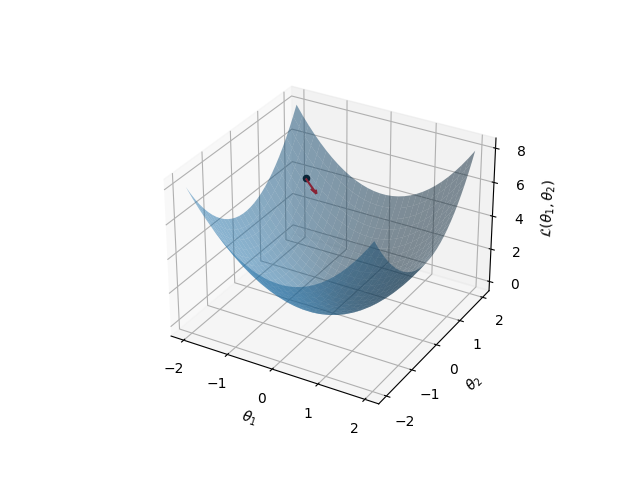
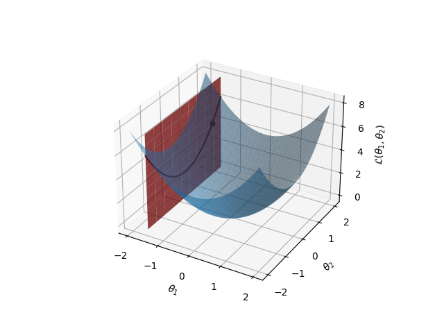
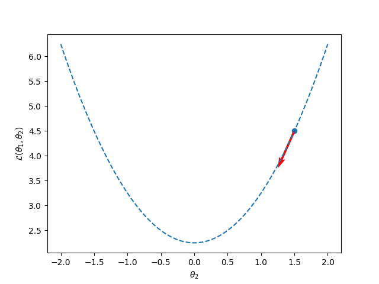

So far, we have only considered a loss which is a function of one parameter. What happens when we have **multiple parameters**?

Fortunately, this is quite straightforward. Each parameter can be considered independent of every other parameter, so **we can compute their gradients in parallel**. For example, if the loss were a function of two parameters, $\mathcal{L}(\theta_1,\theta_2)$, their updates would be:

$$\theta_{1t+1} = \theta_{1t} - \lambda \frac{\partial \mathcal{L}(\theta_1,\theta_2)}{\partial \theta_1}$$

and

$$\theta_{2t+1} = \theta_{2t} - \lambda \frac{\partial \mathcal{L}(\theta_1,\theta_2)}{\partial \theta_2}$$

This parallel property means that multiple parameters are generally treated as a **vector**. The vector of their gradients, $\nabla \pmb\theta$, is a vector pointing in the direction of the steepest upward slope at $\pmb\theta$.

Let's try to **visualise** what this looks like. Suppose our loss surface is a surface over two parameters, $\theta_1$ and $\theta_2$, and is bowl-shaped:

Where our probe is indicated by the black dot at $(\theta_1,\theta_2) = (-1.5,1.5)$. Computing the derivative of the loss with respect to $\theta_1$ is the same as only considering the slice through the surface where $\theta_2 = 1.5$, because we're holding $\theta_2$ **constant**.

You can see the line that the surface makes through the plane in **black**, but let's just zoom into that for a moment.

This now looks a lot more familiar; we know how to compute the gradient of this line — it's just the **slope of the line**. As in the 1D case, the red arrow **indicates the direction we will move in** when we perform gradient descent; its slope is the magnitude of the gradient at this point. The dotted line shows the slice through the true loss surface. If we then consider the red arrow with respect to the whole surface, it remains within the slice:

To get the derivative of the loss with respect to $\theta_2$, we repeat the process but hold $\theta_1$ constant. This means that the new slice will be perpendicular to the old one:

Similarly, when we take the slice we can compute the gradient as before, and hence the direction we would move in if we performed gradient descent just within this slice:

Finally, we can plot both vectors on the surface. **Adding the vectors** will give an arrow that points in the direction of **steepest slope**, which is coloured in black on the plot below.

Going in the direction of this arrow will take you in the direction of **steepest descent** — exactly what we want our algorithm to do.

*(Note: the gradient itself is a 2D vector in the $(\theta_1, \theta_2)$ plane, pointing in the direction of steepest slope **up**. The descent direction is its negative.)*

---

## Batching, SGD, Minibatching

Should we always hold $x$, the data, constant?

* **Yes** — Batching
* **No** — SGD
* **Sort of** — Minibatching

Before we let you loose on toy data, there is an important final thing to address. We haven't made clear how exactly we combine the data with the gradients (as thus far we've just been considering the loss as a function of $\theta$ directly).

There are several options. For the first, you can simply pass all of your data through the model, average the loss, and compute the gradient for each parameter with respect to that loss. However, it turns out that this can have an unfortunate effect; by averaging across all of the data, our gradients are too general. They will capture the main shape of the loss surface, but be unable to discover any nuance. The model will quickly converge to a mediocre solution. This is called **Batch Gradient Descent**.

Second, you pick a data point at random, pass it through the model for a particular parameter setting, and then update your parameters then and there. This is called **Stochastic Gradient Descent**, and for good reason; it is slow to converge and extremely noisy.

The third option balances between these extremes. Between each gradient update, you pass a subset of the data through the model (typically small enough to compute quickly, but large enough that there's a high chance of it being a representative subset). Empirically, this seems to work the best; it is less noisy and quicker than SGD but will find better solutions than batch gradient descent. This is called **minibatching** (each subset is a 'minibatch').