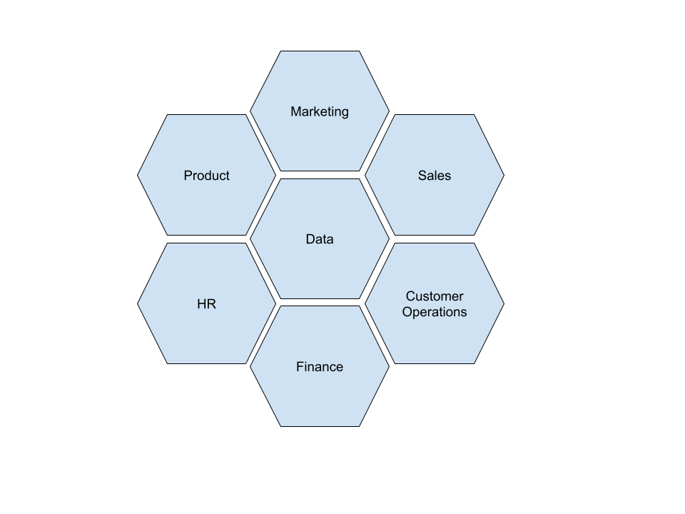

# Enterprise Architecture

*Enterprise Architecture* refers to the structure and organisation of all the systems within an organisation. This can be thought of as a system of systems organisation. Each system has a function and purpose and usually interacts with other systems. There are usually 4 layers in Enterprise Architecture:1. Business Architecture, 2. Data Architecture, 3. Application Architecture, and4. Technology Architecture*Business Architecture* refers to the capabilities and functions of the business itself from stakeholder and customer perspective.   
*Data Architecture* refers to how the data relating to business activities is modelled, governed, stored, integrated across the organisation.   
*Application Architecture* focuses on how various applications are structured, interact with each other and how they scale to handle the business requirements.    
*Technology Architecture* refers to the IT infrastructure and extends to other systems such as finance and communications.In this module, we focus on Data Architecture.    
# Data Architecture  
Data Architecture usually follows organisational and business structure. Certain data will be associated with each business area and be known as domain data.For example, a finance business unit will be associated with data relating to transactions, sales or investments. A product business unit will be associated with data about user activity for that product. The following shows an example of how different business domains may exist.   

Each of these domains will be producing and owning some data. An organisation requires guidance on how the data should be produced, managed, stored, modelled and governed. This is where *data policies* or standards guiding the behaviour regarding data usage, come into play. There are 5 areas to pay special attention to:1. Data Model2. Data Dictionary (or Data Catalogue)3. Data Governance4. Data Integration5. Data Security  
#### Data Model  
Let's start with the data model. This model will have multiple layers showing different views and understanding -- from the business domain level, to all the detail of each table or data file in storage. The audience and usage will determine how the data is represented and modelled. The data analytics and reporting functions will model it as a data warehouse while the product operational services may model it as transactional data.#### Data DictionaryThe data dictionary or catalogue aims to document all the data available within the organisation. A business layer will also be applied to add meaning to the data specifics. For example, a data item called \"status\" might refer to the stock status where values such as \"Available\" might mean \"in stock\", \"reserved\" might mean \"allocated to an order yet to be shipped\" and \"out of stock\" might mean that the item is not available in inventory.  
#### Data Governance  
Data governance refers to the control and policies around data cataloguing and usage. This function allows an organisation to ensure data is used in an appropriate manner.   
#### Data Integration  
Data Integration focuses on how data flows between different systems and domains aiming to ensure accuracy and timeliness.     
#### Data Security  
Data Security underlies all systems and focuses on protecting the data from malicious actors -- both internal users and external attackers. There are usually two layers to this: data access and system access. A database server needs sufficient protection that effectively makes it inaccessible without appropriate credentials while at the data layer to ensure data is stored in an encrypted form so even if acquired it cannot be read.