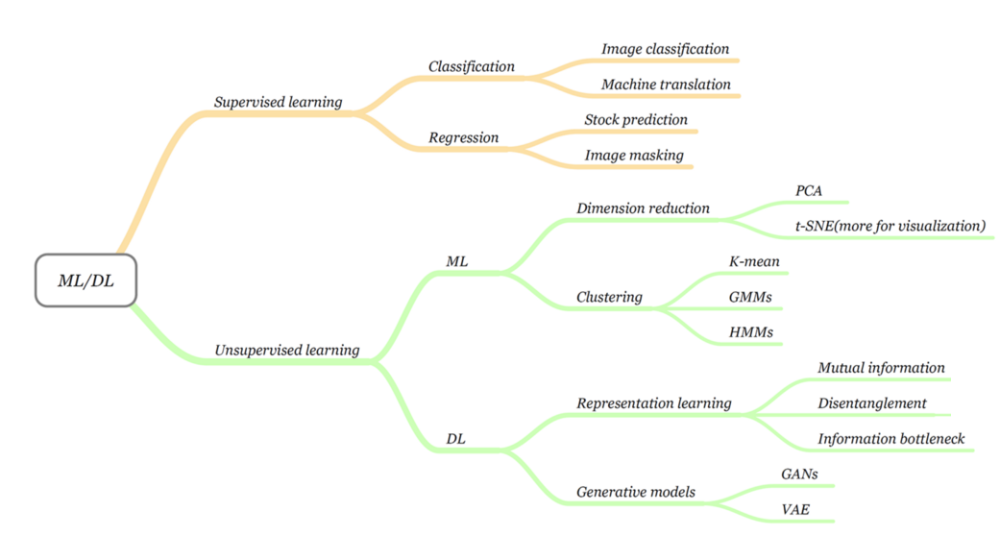
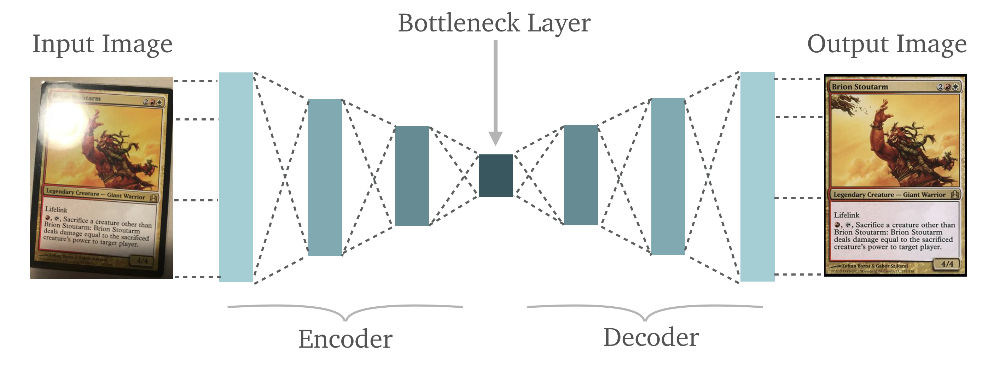
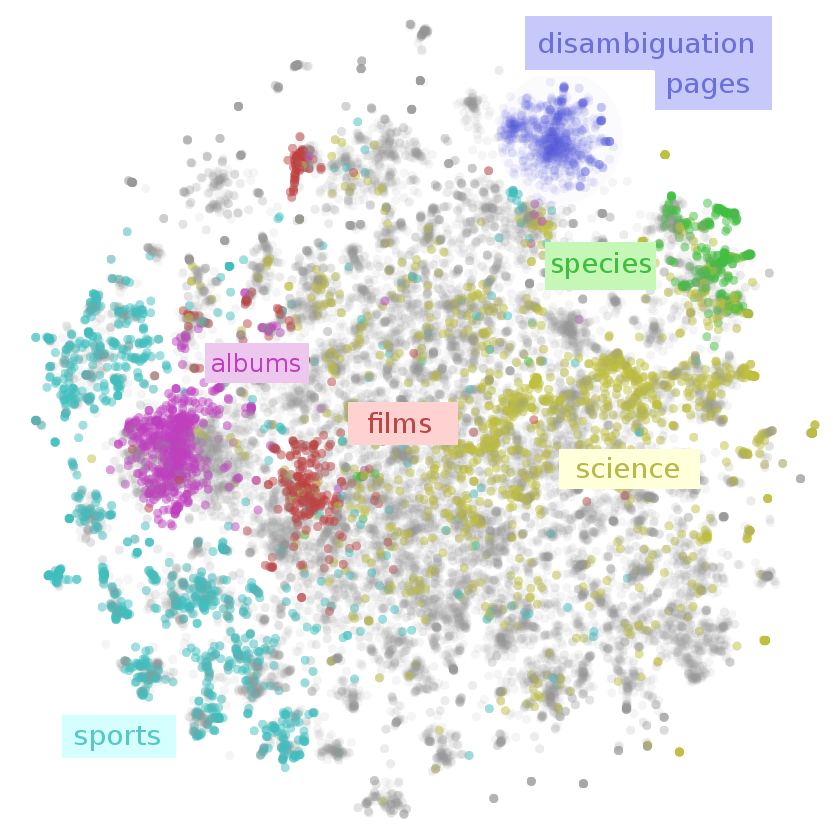

# An introduction to unsupervised learning

In supervised learning we make use of labelled data. For example, in a supervised classification problem, the labels could be a binary variable which represents whether a transaction is fraudulent or not. 

But what if we want to work with unlabelled data?

For instance, we may wish to identify outliers in a dataset, learn new representations of data that can provide new insights, or identify latent groupings (or clusters) in data. 

These tasks are all examples of *unsupervised learning*, where an algorithm learns patterns from data without having access to pre-existing labels. In unsupervised learning all of the variables are treated symmetrically - the model tries to find (either explicitly or implicitly) how all the variables interact with each other.

## Unsupervised learning tasks

Unsupervised learning can be very useful for building a deeper understanding of complex datasets as a standalone tool. For example, a dataset in 4 or 5 dimensions already exceeds our capabilities for visualisation. Things only get worse in higher dimensions. By learning the **structure** of the data, unsupervised learning facilitates a quicker and more efficient examination and comprehension of the data than we could otherwise achieve. It can therefore be enormously helpful in **unearthing** insights which might be buried within a combinatorial explosion of possible charts of the data.

However, unsupervised learning can also be used as part of a supervised modelling *pipeline*, for:
* **exploratory data analysis** (EDA) 
* **data processing**, including outlier detection,
* **feature engineering** - either for adding new features to data or transforming the data into new representations.

In the context of exploratory data analysis, unsupervised learning provides a suite of tools which allows us to quickly and efficiently understand the structure and relationships within the data. This can inform us about which supervised learning algorithms we might want to use, and/or some useful feature transformations that could be performed. We may also discover some unusual relationships or unexpected clusters of customers, anomalies etc. This can provide a wealth of useful information which can be used for further experimentation or data collection. By transforming our data, or adding new informative features, unsupervised learning can also be used to make data easier for supervised learning algorithms to analyse. For instance, Principal Component Analysis, which is frequently used for feature engineering, can be considered as a simple unsupervised learning algorithm.

Another very important unsupervised learning task is generating **synthetic data**. Generative models aim to learn the actual **distribution** of the data $P(X)$, so that they can be used to simulate new examples. This is an area which has really exploded with the advent of powerful deep learning techniques, enabling for powerful image and text generation tools. 

Note that not all generative models are unsupervised. For example, the Naive Bayes classifier learns the joint distribution $P(X,Y)$ of the data and labels in order to perform supervised classification. This joint distribution can then be used to generate new data (with associated labels).

## Unsupervised learning algorithms

There are many unsupervised learning algorithms we can use for different tasks. The image below shows several different supervised and unsupervised tasks, and highlights different models you might use for each. 

## A note on terminology - supervised vs unsupervised

It can sometimes be confusing to determine if a model is supervised or unsupervised, particularly for complex deep learning models. This is partly because the same task could be performed in different ways. For example, imagine a model that is designed to remove noise from images. One way to train the model would be to give it a set of pairs of images, one with noise and one without. By analysing the images and understanding the relationships with the associated labels (noisy or not noisy) the model could learn to identify and replace noisy pixels. This would be a supervised learning approach. However, another way to approach this task would be to give the model only the images without noise. By analysing all of the images together, the model could learn an efficient transformation of the images in which only the most relevant information is retained. When noisy images are then transformed into the same representation (and back again), the noise is then removed. This is an unsupervised learning approach. 

Example: denoising autoencoder

Note that complex models can also combine supervised and unsupervised elements. For example, Generative Adversarial Networks (GANs) which have seen much success for image generation, pit an unsupervised *generator* network (which creates synthetic data from random noise) against a supervised *disctiminator* network which tries to distinguish between labelled real and synthetic data. 

## Example - analysing Wikipedia pages

The following image shows Wikipedia articles embedded in a two-dimensional space by similarity of content (which is in a high dimensional space, and hard to visualise). In this 2D space, distinct latent clusters or groupings of articles are readily apparent, and these clusters can be automatically identified using a clustering algorithm. 

By overlaying the real page categories (which were not used as an input of the unsupervised model), we see that the latent clusters correspond well to real world categories, validating that the embedding is informative. 

## Assessing the performance of unsupervised models

For classical supervised learning, such as classification or regression, it is quite straightforward to quantify how well a model is performing - we can just measure how well our predictions match real data. 

How do we evaluate the performance of an unsupervised learning algorithm when we're introducing something latent? In the previous example, we could validate that the latent clusters identified in Wikipedia articles closely matched actual categories. However, what if we lack access to such labels?

In practice, evaluating unsupervised learning models is harder, and is often done by evaluating how **useful** the added information is for a process. For example, if we analyse the clusters identified for customer data, do these clusters actually tell us something interesting about the behaviour of the customers? 